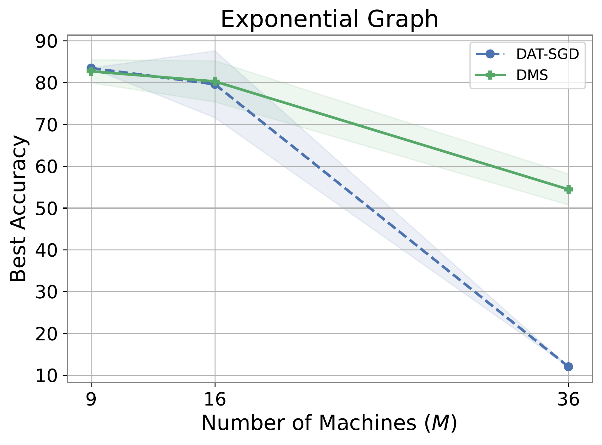
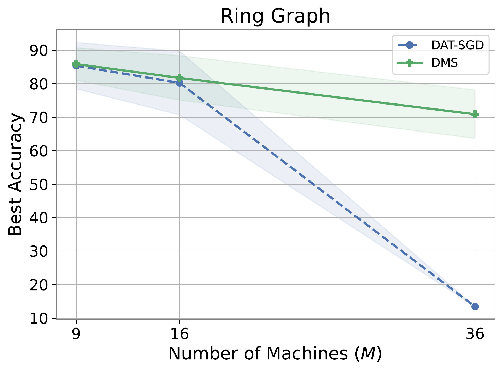

# DMS_experiments_rebuttal

**Figure 1. Exponential Graph.**
Best accuracy on MNIST as a function of the number of machines M in {9, 16, 36} on an exponential graph topology (1/rho = O(log M)). Each machine receives heterogeneous data (8 out of 10 classes); the test set comprises all 10 classes. Shaded bands denote standard deviation across random seeds. DMS consistently achieves higher accuracy and degrades more gracefully as M grows. The decline at M = 36 is expected, as this regime lies beyond the theoretical parallelism bound; we deliberately track iterations past this threshold to expose the degradation behavior. Notably, DMS remains substantially more robust than DAT-SGD even in this over-parallelized regime, highlighting its improved scalability on fast-mixing topologies.
---

### Ring Graph

**Figure 2. Ring Graph.**
Best accuracy on MNIST (each machine receives 8 out of 10 classes) as a function of the number of machines M in {9, 16, 36} on a ring graph topology (spectral gap rho = O(M^{-2})), comparing DMS and DAT-SGD. Shaded bands denote standard deviation across random seeds. DMS maintains substantially higher accuracy across all values of M, retaining ~71% accuracy at M = 36 while DAT-SGD collapses to ~14%. The poor performance of DAT-SGD at high M is partly due to iterations being truncated after a fixed budget, which limits convergence when M exceeds the parallelism bound. 
